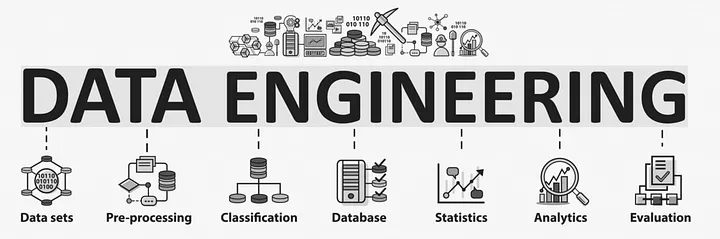
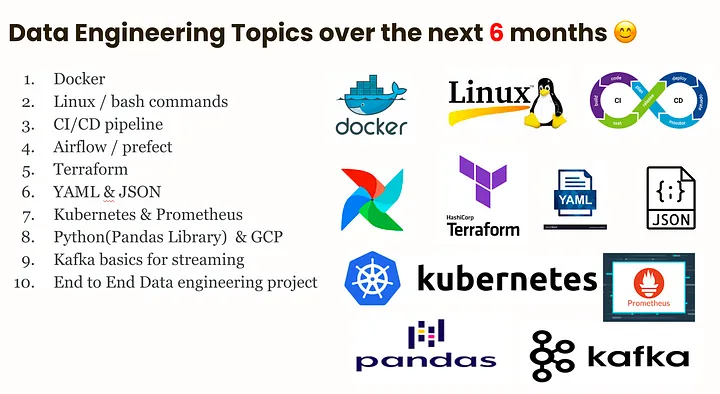

# Apa Itu Data Engineering? 🤔

Data engineering adalah bidang rekayasa perangkat lunak yang berkaitan dengan merancang, membangun, dan memelihara infrastruktur yang diperlukan untuk mendukung pemrosesan data dalam skala besar. Dalam dunia yang semakin didorong oleh data ini, data engineering melibatkan pengembangan sistem untuk mengumpulkan, menyimpan, memproses, dan menganalisis volume data yang besar dengan efisien. 📊

## Mengapa Data Engineering Penting? 🚀

Data engineering sangat penting bagi organisasi yang ingin mendapatkan wawasan dari data mereka. Tanpa infrastruktur data engineering yang tepat, menjadi sulit untuk memproses, menyimpan, dan mengambil data secara tepat waktu, yang dapat menyebabkan keterlambatan dalam proses pengambilan keputusan. ⏳ Data engineering adalah tulang punggung dari setiap organisasi yang berbasis data, dan membantu organisasi untuk mengekstrak nilai dari data mereka. 🔍

## Tanggung Jawab Seorang Data Engineer 🛠️

Tanggung jawab utama seorang data engineer meliputi:

- **Merancang dan mengimplementasikan sistem pemrosesan data:** Membangun arsitektur yang dapat menangani aliran data yang besar.
- **Mengembangkan dan memelihara pipeline data:** Membuat alur kerja yang mengotomatiskan proses pengumpulan dan pengolahan data.
- **Membangun dan memelihara basis data dan data warehouse:** Mengelola tempat penyimpanan data untuk memastikan akses yang cepat dan aman.
- **Membuat dan memelihara proses ETL (Extract, Transform, Load) data:** Mengumpulkan data dari berbagai sumber, mengubahnya menjadi format yang dapat digunakan, dan memuatnya ke dalam sistem penyimpanan.
- **Menjamin kualitas dan keamanan data:** Memastikan bahwa data yang diproses adalah akurat dan aman dari akses tidak sah.
- **Berkolaborasi dengan analis data dan ilmuwan data:** Bekerja sama untuk membangun aplikasi berbasis data yang memberikan wawasan berharga. 🤝

## Mengapa Analis Data Harus Mempelajari Keterampilan Data Engineering di Tahun 2023? 📈

Analis data harus mempelajari keterampilan data engineering di tahun 2023 karena:

1. **Permintaan untuk data engineer semakin meningkat:** Data analis dengan keterampilan data engineering sangat dihargai di pasar kerja, dan memiliki peluang lebih baik untuk mendapatkan pekerjaan.
2. **Memahami infrastruktur data:** Keterampilan ini memungkinkan analis untuk memahami bagaimana data dikumpulkan dan dikelola, sehingga dapat melakukan analisis dengan lebih efektif.
3. **Membangun pipeline data:** Dengan keterampilan ini, analis dapat membangun alur kerja yang mengotomatiskan pemrosesan data, menghemat waktu dan meningkatkan kualitas data.
4. **Peluang karier yang lebih baik:** Analis data dengan keterampilan ini memiliki peluang untuk bertransisi ke peran yang lebih tinggi seperti arsitek data atau ilmuwan data, yang sering kali memiliki gaji lebih tinggi. 💼

## Dalam Ringkasan 📚

### Fokus
Data engineering berfokus pada membangun infrastruktur yang diperlukan untuk memproses dan menganalisis data, sementara DevOps berfokus pada mengotomatiskan proses pengembangan, penerapan, dan pemeliharaan perangkat lunak.

### Alat
Data engineering bergantung pada alat dan teknologi yang dirancang khusus untuk bekerja dengan data, seperti data warehouse, alat ETL, dan kerangka kerja komputasi terdistribusi. Di sisi lain, DevOps menggunakan alat yang dirancang untuk otomatisasi pengembangan dan penerapan perangkat lunak, seperti alat integrasi/pengiriman berkelanjutan, platform kontainerisasi, dan alat infrastruktur-sebagai-kode. 🛠️

### Keahlian
Data engineer biasanya memiliki latar belakang dalam rekayasa perangkat lunak, ilmu komputer, atau bidang terkait, dan mereka berspesialisasi dalam bekerja dengan teknologi terkait data. Di sisi lain, insinyur DevOps biasanya memiliki latar belakang dalam operasi atau administrasi sistem, dan mereka berspesialisasi dalam bekerja dengan alat otomatisasi dan infrastruktur. 🔧

### Tujuan
Tujuan data engineering dan DevOps berbeda. Data engineering berfokus pada membangun sistem pemrosesan data yang skalabel dan efisien, sementara DevOps berfokus pada meningkatkan kecepatan dan keandalan proses pengembangan dan penerapan perangkat lunak. Meskipun mungkin ada beberapa tumpang tindih dalam alat dan teknologi yang digunakan oleh data engineer dan insinyur DevOps, tujuan keseluruhan mereka berbeda. 🎯

## Perbandingan antara Data Engineering & DevOps 🆚

| Aspek        | Data Engineering                                  | DevOps                                        |
|--------------|--------------------------------------------------|----------------------------------------------|
| Fokus        | Membangun infrastruktur pemrosesan data          | Mengotomatiskan pengembangan dan penerapan perangkat lunak |
| Alat         | Alat yang dirancang untuk data (data warehouse, ETL) | Alat untuk otomatisasi pengembangan (CI/CD, kontainer) |
| Keahlian     | Rekayasa perangkat lunak dan teknologi data      | Operasi dan administrasi sistem              |
| Tujuan       | Membangun sistem pemrosesan data yang efisien    | Meningkatkan kecepatan dan keandalan pengembangan perangkat lunak |

