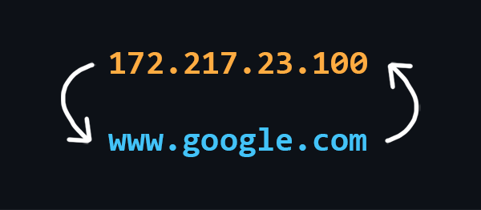

# 🌐 What is DNS?

# 🌐 Apa itu DNS?

**DNS (Domain Name System)** adalah sistem penamaan yang terdesentralisasi untuk alamat Internet. Ini memungkinkan pembuatan nama yang dapat dibaca manusia (nama domain) yang sesuai dengan alamat IP numerik yang digunakan oleh komputer, sehingga membuat web lebih mudah diakses oleh pengguna.

## Struktur DNS

DNS terdiri dari banyak node independen, masing-masing bertanggung jawab untuk menyimpan hanya data yang relevan dengan area spesifiknya. Struktur terdesentralisasi ini meningkatkan keandalan dan efisiensi sistem.

## Komponen Utama

### DNS Resolver
**DNS Resolver** adalah server yang biasanya terletak dekat dengan Penyedia Layanan Internet (ISP) Anda. Ia melakukan fungsi-fungsi berikut:
- Mencari alamat berdasarkan nama domain.
- Menyimpan respons (secara temporer) untuk pemulihan yang cepat pada permintaan di masa mendatang.

## Tipe Record DNS

Ada beberapa tipe record DNS, masing-masing memiliki tujuan unik:

- **A Record**: Mengasosiasikan nama domain dengan alamat IPv4.
- **AAAA Record**: Menghubungkan nama domain dengan alamat IPv6.
- **CNAME Record**: Mengalihkan satu nama domain ke nama domain lain.
- **MX Record**: Menentukan server pertukaran email untuk domain.
- **NS Record**: Menunjukkan server nama yang berwenang untuk domain.
- **PTR Record**: Menyediakan nama domain yang terkait dengan alamat IP.
- **SOA Record**: Berisi informasi administratif tentang domain.

---

Memahami DNS sangat penting untuk menjelajahi Internet, karena memainkan peran vital dalam menerjemahkan nama domain yang ramah pengguna menjadi alamat IP yang dapat dibaca mesin.

[whats browser?](whats_browser.md)
[Whats VPN AND PROXY?](vpn_and_proxy.md)
[TCP/IP](tcp/IP.md)
