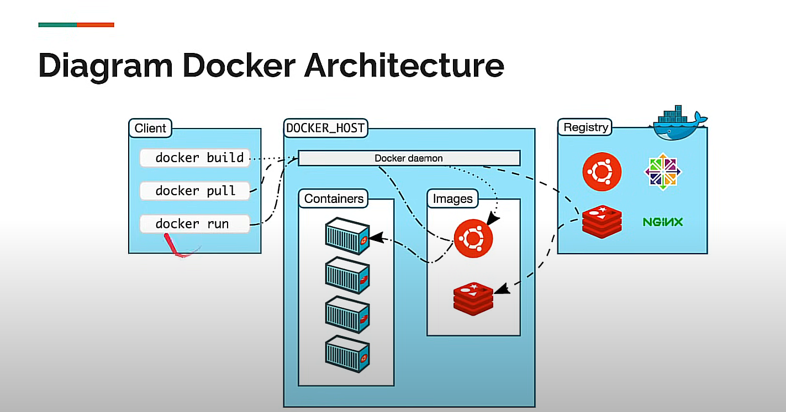

# 🐳 Docker: Pengertian & Konsep Dasar

**Docker** adalah platform open-source yang dirancang untuk memudahkan pengembangan, pengujian, dan penerapan aplikasi dalam bentuk *container*. Dengan Docker, lo bisa nge-package aplikasi beserta semua dependencies-nya dalam satu wadah yang terisolasi, jadi aplikasi tersebut bisa dijalankan di mana aja dengan environment yang konsisten. Docker ini bener-bener ngebantu menghilangkan masalah klasik “works on my machine” yang sering dialamin developer.

---

## 📦 Apa itu Docker?

Docker adalah platform yang memungkinkan pengembang buat bikin, deploy, dan ngejalanin aplikasi di dalam *container*. Container itu sendiri adalah unit yang berisi aplikasi lo sama semua yang dibutuhin buat jalan (kayak libraries, dependencies, dll), jadi lo gak perlu ribet install macem-macem di setiap tempat lo deploy. Lo tinggal bikin sekali, dan jalanin di mana aja—di laptop, server, atau cloud.

---

## ✨ Konsep Dasar Docker

Berikut adalah beberapa konsep kunci yang perlu lo ngerti tentang Docker:

1. **Image**  
   Docker *image* adalah template yang immutable (gak bisa diubah) buat nge-package aplikasi lo. Bayangin *image* ini kayak snapshot yang punya semua hal yang aplikasi lo butuhin buat jalan, dari kode aplikasi, libraries, tools, sampe setting environment-nya. Setiap kali lo bikin container, lo bikin *instance* dari *image* ini.

2. **Container**  
   Docker *container* adalah instansi dari *image* yang lo bikin. Container ini yang jalanin aplikasi lo di environment terisolasi. Karena semuanya ada di dalam *container*, lo bisa nge-run aplikasi lo di mana aja tanpa perlu install ulang atau setup environment lagi. Jadi, container ini ngejamin aplikasi lo bisa jalan konsisten di semua environment.

3. **Docker Engine**  
   Ini adalah *core* dari Docker yang ngejalanin container. Docker Engine bertanggung jawab buat nge-manage container, nge-run, nge-stop, dan ngelakuin segala operasi yang berhubungan sama container.

4. **Docker Hub**  
   Docker Hub adalah semacam *repository* cloud buat Docker images. Di sini, lo bisa nyari atau nge-download image yang udah disediain oleh komunitas atau bikin image lo sendiri dan nge-publish ke Docker Hub biar bisa diakses oleh orang lain.

---

## 🛠️ Kenapa Lo Harus Pakai Docker?

1. **Portabilitas**  
   Dengan Docker, lo bisa jalanin aplikasi lo di mana aja. Gak peduli platform atau environment apa yang dipake, selama ada Docker Engine, lo tinggal deploy *container* lo tanpa harus setup macem-macem lagi.

2. **Isolasi**  
   Setiap container jalan secara terisolasi. Artinya, satu container gak bakal ngaruh ke container lain atau ke *host* machine lo. Ini bikin Docker cocok banget buat ngelola banyak aplikasi atau service yang jalan di environment yang sama tanpa ada risiko bentrok antar-dependencies.

3. **Efisiensi**  
   Container lebih ringan dibanding Virtual Machines (VM). VM butuh resource lebih besar karena dia nge-simulate satu sistem operasi penuh, sedangkan container cuma butuh resource yang dipake aplikasi dan dependensinya. Ini bikin Docker lebih efisien dalam hal resource dan performa.

---

## ⚙️ Perbedaan Docker dengan Virtual Machine

Salah satu hal yang sering bikin bingung adalah perbedaan antara Docker dan Virtual Machine (VM). Meskipun keduanya sama-sama bisa menjalankan aplikasi di environment yang terisolasi, ada beberapa perbedaan mendasar:

| **Aspek**         | **Docker**                                       | **Virtual Machine**                               |
| ----------------- | ---------------------------------------------- | ------------------------------------------------- |
| Isolasi           | Container (ringan, share kernel dengan host)    | VM (berat, tiap VM punya OS sendiri)              |
| Kecepatan         | Startup cepat (detik)                           | Startup lambat (menit)                            |
| Resource          | Efisien, pake sedikit resource                  | Boros resource (butuh RAM & storage lebih banyak) |
| Ukuran            | Image/container lebih kecil (MB)                | Ukuran VM lebih besar (GB)                        |
| Penggunaan        | Ideal buat microservices dan DevOps workflows   | Ideal buat aplikasi kompleks atau isolasi lengkap |

---

## 🚀 Kesimpulan

Docker udah jadi salah satu tools paling penting di era modern software development. Dengan Docker, lo bisa nge-develop, nge-test, dan nge-deploy aplikasi dengan cara yang lebih cepat, portable, dan efisien. Konsep *containerization* ini membantu aplikasi lo berjalan konsisten di berbagai platform tanpa harus ribet ngatur ulang environment setiap kali deploy. Jadi, kalau lo mau bikin deployment yang scalable dan gampang, Docker definitely worth checking out!
