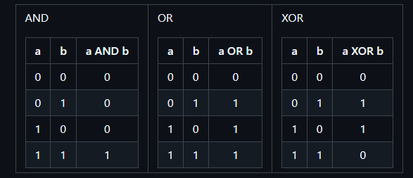

# 🔗 Konektif Logis dalam Pemrograman

Konektif logis adalah bagian penting dalam pemrograman yang digunakan untuk menangani tipe boolean (benar/salah atau 1/0). Hasil dari ekspresi boolean juga merupakan nilai dari tipe boolean.

## 🧮 Tabel Kebenaran

### 1. **AND (Konjungsi)**
Operasi AND mengembalikan nilai benar hanya jika kedua operand bernilai benar.

| a | b | a AND b |
|---|---|---------|
| 0 | 0 |    0    |
| 0 | 1 |    0    |
| 1 | 0 |    0    |
| 1 | 1 |    1    |

### 2. **OR (Disjungsi)**
Operasi OR mengembalikan nilai benar jika salah satu atau kedua operand bernilai benar.

| a | b | a OR b |
|---|---|--------|
| 0 | 0 |   0    |
| 0 | 1 |   1    |
| 1 | 0 |   1    |
| 1 | 1 |   1    |

### 3. **XOR (Exclusive OR)**
Operasi XOR mengembalikan nilai benar jika tepat satu dari operand bernilai benar.

| a | b | a XOR b |
|---|---|---------|
| 0 | 0 |    0    |
| 0 | 1 |    1    |
| 1 | 0 |    1    |
| 1 | 1 |    0    |

## 🛠️ Operasi Dasar Logika

Ada tiga operasi dasar yang menjadi landasan bagi semua jenis operasi logika lainnya:

- **AND** (`&&`): Mengembalikan true jika kedua operand benar.
- **OR** (`||`): Mengembalikan true jika salah satu atau kedua operand benar.
- **NOT** (`!`): Mengembalikan nilai kebalikan dari operand.

### Operasi XOR (Modulus 2 Penjumlahan)
Operasi XOR sangat penting dalam teori pengkodean dan jaringan komputer. Ini memungkinkan kita untuk melakukan operasi penjumlahan yang menghasilkan nilai unik dalam konteks boolean.

## 📊 Tabel Kebenaran
Tabel kebenaran digunakan untuk mendeskripsikan data input dan hasil kembalian dari operasi logika. Ini membantu kita memahami bagaimana konektif logis berfungsi dalam program.

## ⚖️ Prioritas Operasi
- **NOT** memiliki prioritas tertinggi.
- Diikuti oleh **AND**.
- Terakhir adalah **OR**.

Kamu bisa mengubah urutan ini dengan menggunakan tanda kurung untuk mengelompokkan operasi sesuai kebutuhanmu.

---

## 🌟 Kesimpulan
Memahami konektif logis adalah fundamental untuk menjadi pemrogram yang handal. Dengan mempelajari cara kerja AND, OR, dan NOT, kamu dapat membangun logika yang lebih kompleks dalam kode kamu. Selamat belajar dan semoga bermanfaat! 💻✨
