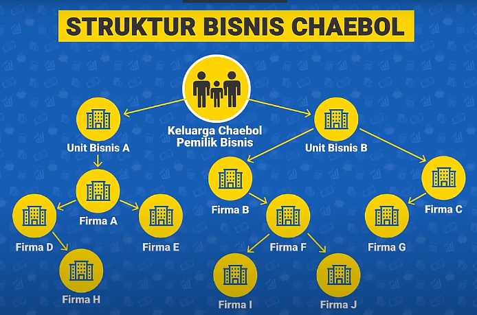

# Ekonomi Korea Selatan 🇰🇷

### 1. **Tingkat Perceraian Tinggi & Tren Pernikahan Menurun 💔**

Tingkat perceraian di Korea Selatan terbilang tinggi, dan salah satu faktor penyebabnya adalah **perubahan nilai sosial** serta **kecenderungan generasi muda** yang enggan menikah. Banyak dari generasi muda, khususnya **CW2 (Contemporary Women 2nd Generation)**, yang lebih memilih untuk tidak menikah. Beberapa alasan utama termasuk **karir**, **kemandirian**, dan **ketidaksetaraan gender** dalam rumah tangga. Selain itu, **biaya hidup** yang semakin mahal, terutama di kota-kota besar seperti Seoul, juga membuat banyak orang enggan untuk membentuk keluarga. 

### 2. **Tingginya Persentase Operasi Plastik 💉**

Korea Selatan dikenal dengan tingkat **operasi plastik tertinggi di dunia**. Mayoritas wanita di Korea, bahkan pria, menjalani prosedur kosmetik untuk **memperbaiki penampilan** mereka. Fenomena ini menciptakan budaya kecantikan yang sangat menekankan penampilan fisik. Menurut beberapa laporan, sekitar **30% wanita dewasa** di Korea Selatan telah menjalani **operasi plastik**, dengan prosedur paling umum termasuk **perubahan bentuk hidung, kelopak mata, dan wajah**.

### 3. **Kebijakan Pro-Keluarga untuk Meningkatkan Kelahiran 👶**

Untuk menghadapi penurunan angka kelahiran dan krisis demografi, pemerintah Korea Selatan memberikan berbagai **insentif pro-keluarga** yang cukup menggiurkan bagi pasangan yang memiliki anak:

- **Gratis biaya lahiran** 🏥: Pemerintah menanggung biaya kelahiran, memberikan bantuan untuk meringankan beban finansial orang tua yang baru memiliki anak.
- **Subsidi rumah** 🏠: Ada berbagai **subsidi rumah** yang ditawarkan, baik untuk **sewa**, **beli rumah**, atau untuk **membantu pembangunan tempat tinggal** bagi keluarga muda.
- **Program bayi tabung gratis** 💉: Pemerintah memberikan **program bayi tabung secara gratis** untuk pasangan yang kesulitan memiliki anak secara alami, untuk mendorong angka kelahiran yang lebih tinggi.

### 4. **Insentif untuk Pasangan yang Memiliki Anak 💰**

Pasangan yang memiliki anak di Korea Selatan dapat menerima berbagai **insentif dari pemerintah** untuk membantu biaya kehidupan mereka, termasuk:

- **Subsidi sewa, beli, dan rumah** 🏡: Insentif ini berupa bantuan untuk membeli atau menyewa rumah, yang sangat penting di negara dengan biaya hidup yang tinggi seperti Korea.
- **Pembebasan pajak** 🧾: Pemerintah memberikan pembebasan pajak untuk pasangan yang memiliki anak, guna mengurangi beban finansial mereka.
- **Fasilitas kesehatan gratis** 🏥: Pemerintah memberikan **akses ke fasilitas kesehatan gratis** untuk keluarga dengan anak-anak, termasuk untuk **perawatan medis dan vaksinasi**.
- **Program bayi tabung gratis** 💉: Selain subsidi kelahiran, **program bayi tabung** juga diberikan secara gratis untuk pasangan yang membutuhkan bantuan medis untuk memiliki anak.

### 5. **Kekuatan Ekonomi Korea: Konglomerat Chaebol 💼**

**Chaebol** adalah kelompok konglomerat besar di Korea Selatan yang sangat berpengaruh dalam perekonomian negara ini. **Chaebol** terbesar, seperti **Samsung**, **Hyundai**, **LG**, dan **SK**, berkontribusi sekitar **78% dari PDB** Korea Selatan. Meskipun Chaebol ini memiliki banyak sektor yang berbeda, mulai dari **elektronik**, **otomotif**, hingga **konstruksi**, mereka tetap menjadi penggerak utama pertumbuhan ekonomi.

- **Samsung** adalah contoh utama Chaebol yang mendominasi pasar teknologi global.
- **Hyundai** dan **Kia** menjadi raksasa otomotif yang telah menembus pasar internasional.
  
Kehadiran **Chaebol** ini memberikan stabilitas ekonomi, namun juga menciptakan tantangan dalam hal **persaingan pasar** dan **monopoli**. Di sisi lain, kebergantungan pada Chaebol menghambat perkembangan **perusahaan kecil dan menengah (UKM)** yang kesulitan untuk bersaing dengan kekuatan besar ini.

### 6. **Faktor Lain yang Memengaruhi Ekonomi Korea 🇰🇷**

- **Industri Teknologi & Elektronik** ⚡: Korea Selatan merupakan salah satu **pemimpin global dalam industri teknologi**, dengan **Samsung**, **LG**, dan **SK Hynix** sebagai pemain utama yang menguasai pasar **smartphone**, **semikonduktor**, dan **TV pintar**.
- **Sektor Otomotif** 🚗: Korea Selatan adalah rumah bagi beberapa merek mobil terbesar di dunia, seperti **Hyundai**, **Kia**, dan **Genesis**, yang berhasil menembus pasar internasional.
- **Investasi dalam R&D** 🔬: Pemerintah Korea dan perusahaan-perusahaan besar seperti **Samsung** dan **Hyundai** sangat fokus pada **penelitian dan pengembangan** untuk menciptakan inovasi dalam berbagai sektor, mulai dari **teknologi informasi**, **otomotif**, hingga **energi terbarukan**.
  
Meskipun menghadapi beberapa tantangan, seperti **krisis demografi** dan **ketergantungan pada Chaebol**, ekonomi Korea Selatan tetap menjadi salah satu ekonomi terbesar dan paling maju di dunia. 🌍

