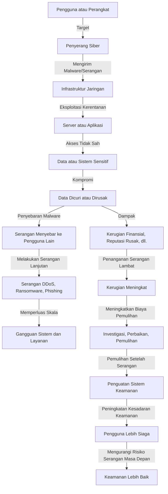

# Peta Teknologi Keamanan Siber

## 1. Alur Serangan Siber (Cyber Attack Flow)

# Peta Teknologi Keamanan Siber

## 2. Jenis Serangan Siber

| **Jenis Serangan**         | **Deskripsi**                                                                 |
|----------------------------|-------------------------------------------------------------------------------|
| **Phishing**               | Penipuan melalui email atau pesan yang meniru organisasi terpercaya untuk mencuri data pribadi. |
| **DDoS (Distributed Denial of Service)** | Serangan yang menyebabkan website atau layanan tidak dapat diakses dengan membanjiri server dengan lalu lintas. |
| **Malware** (Ransomware, Trojan, Virus) | Perangkat lunak jahat yang disisipkan untuk mencuri data atau merusak sistem. |
| **Man-in-the-Middle Attack** | Penyerang memposisikan diri di antara komunikasi dua pihak untuk mencuri informasi. |

## 3. Dampak Serangan Siber

| **Jenis Serangan**         | **Dampak Utama**                                                              |
|----------------------------|-------------------------------------------------------------------------------|
| **Phishing**               | Pencurian identitas, data pribadi dicuri                                       |
| **DDoS**                   | Layanan offline, bisnis terganggu                                              |
| **Malware**                | File dikunci, kerugian finansial, data hilang                                  |
| **Man-in-the-Middle**      | Kompromi data rahasia, komunikasi disadap                                      |

## 4. Pencegahan dan Tindakan Keamanan

| **Jenis Keamanan**                     | **Penjelasan**                                                       | **Dampak Pencegahan**                         |
|----------------------------------------|-----------------------------------------------------------------------|-----------------------------------------------|
| **Firewall**                           | Memfilter lalu lintas masuk dan keluar untuk memblokir aktivitas mencurigakan. | Mencegah akses tidak sah ke jaringan          |
| **Antivirus dan Anti-Malware**         | Melindungi perangkat dari perangkat lunak berbahaya                    | Mencegah penyebaran malware                   |
| **Enkripsi Data**                      | Mengamankan data dengan kode sehingga hanya pihak berwenang yang bisa mengakses | Melindungi data dari pencurian                |
| **Autentikasi Multi-Faktor (MFA)**     | Menambahkan lapisan keamanan dengan memerlukan beberapa bentuk verifikasi | Mencegah akses tidak sah ke akun              |
| **Pembaruan Sistem**                   | Memperbaiki celah keamanan dengan mengupdate perangkat lunak            | Mencegah eksploitasi celah keamanan           |
| **Pelatihan Kesadaran Keamanan**       | Mengajarkan karyawan tentang praktik keamanan siber                    | Mengurangi risiko serangan phishing           |

## 5. Tips Umum untuk Mencegah Serangan Siber

- **Gunakan Kata Sandi Kuat**: Gunakan kata sandi yang sulit ditebak dengan kombinasi huruf besar, kecil, angka, dan simbol.
- **Selalu Perbarui Perangkat Lunak**: Pastikan perangkat lunak selalu dalam versi terbaru untuk memperbaiki kerentanan keamanan.
- **Waspadai Phishing**: Jangan pernah klik tautan yang mencurigakan dalam email atau pesan yang tidak dikenal.
- **Gunakan VPN Saat Terhubung ke Jaringan Publik**: Ini akan mengenkripsi data dan melindungi dari penyadapan.
- **Aktifkan MFA (Multi-Factor Authentication)**: Tambahkan lapisan perlindungan ekstra pada akun penting.
- **Pakai Software Antivirus**: Instal dan selalu perbarui perangkat lunak antivirus di perangkat Anda.
