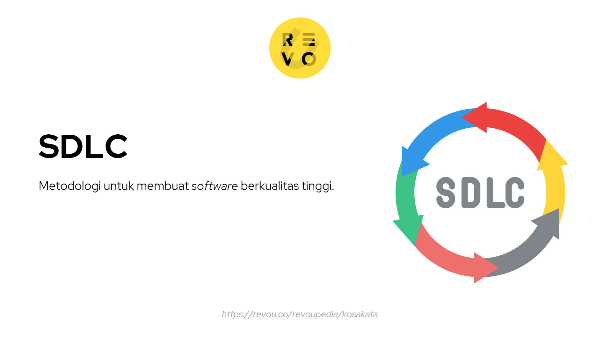
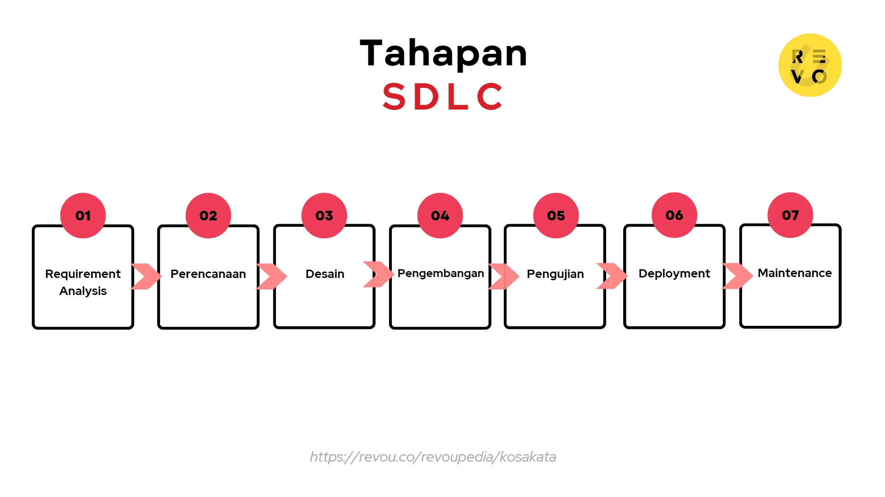

### Apa itu SDLC (Software Development Life Cycle)? 🚀

SDLC adalah metodologi untuk membuat software berkualitas tinggi. Saat perusahaan ingin mengembangkan software, product manager dan tim developer akan menjalani berbagai proses untuk menyelesaikannya. Untuk itu, dibutuhkan cara yang terstruktur agar hasilnya maksimal. Tujuan SDLC adalah untuk merancang, mengembangkan, menguji, dan mendistribusikan software sehingga produk akhirnya sesuai ekspektasi dan anggaran. 💻

### Langkah atau Tahapan SDLC 🛠️

Berikut ini adalah langkah atau tahapan SDLC:

#### 1. **Requirement Analysis** 📊  
Sebagai awal dari SDLC, tim developer baik front end maupun back end menganalisis persyaratan software, misal software seperti apa yang akan dibuat, fitur yang harus dimiliki, dan masalah yang harus dipecahkan. Tim tersebut juga akan berdiskusi dengan stakeholder dan mengumpulkan informasi tentang kebutuhan dan harapan mereka.  

#### 2. **Perencanaan** 📅  
Di tahap ini, tim developer membuat rencana untuk proyek tersebut. Rencana tersebut dapat meliputi tugas, jadwal, sumber daya, dan anggaran yang diperlukan untuk proses pengembangan. Perencanaan ini bermanfaat untuk menguraikan tujuan proyek dan cara mencapainya.  

#### 3. **Desain** 🎨  
Tim developer kemudian akan mendesain software, termasuk arsitektur dan fungsinya. Misalnya, di tahap ini, tim tersebut dapat menentukan bagaimana software bekerja, cara data diolah, dan cara user menggunakannya.  

#### 4. **Pengembangan** 👨‍💻  
Pada tahap ini, pengembangan software yang sebenarnya terjadi. Developer akan melakukan coding untuk software serta menggunakan bahasa pemrograman dan tools untuk membangun software menggunakan desain yang sudah dibuat.  

#### 5. **Pengujian** 🧪  
Setelah software dibuat, dilakukan pengujian supaya dapat memastikan bahwa software bekerja sesuai persyaratan yang ditetapkan. Tim developer akan mengetes fungsionalitas, kinerja, dan keamanan software, serta mengidentifikasi masalah yang perlu ditangani.  

#### 6. **Deployment** 🚚  
Setelah pengujian, software akan disebarkan ke end user. Karenanya, tim developer akan memastikan bahwa software di-install dan di-setting dengan benar supaya berfungsi sesuai dengan yang diharapkan.  

#### 7. **Maintenance** 🔧  
Berdasarkan hasil deployment, tim developer akan memelihara dan memperbarui software supaya dapat berfungsi dengan baik dan memenuhi kebutuhan penggunanya. Di tahap ini, perubahan pada software mungkin akan dilakukan untuk memperbaiki bug, menambah fitur baru, atau meningkatkan kinerjanya.  

### Metode-metode SDLC 🔄

Menurut Robert Half, berikut ini adalah beberapa metode SDLC yang baik untuk digunakan:  

#### 1. **Agile** ⚡  
Agile adalah metode yang fleksibel dan berulang untuk pengembangan software. Melalui metode ini, software yang dibuat akan diuji dalam bagian kecil untuk mengukur performa fitur tertentu. Pendekatan ini memerlukan kerja sama yang erat untuk beradaptasi dengan feedback dari stakeholders.  

#### 2. **Lean** 💡  
Lean adalah pendekatan untuk pengembangan software yang berfokus pada efisiensi dan menghilangkan pemborosan. Misalnya saja, melalui metode ini, tim developer dapat mengurangi kompleksitas yang tidak perlu dan terus meningkatkan proses pengembangan.  

#### 3. **Waterfall** 🌊  
Waterfall adalah cara mengembangkan software sesuai urutannya tanpa pengulangan atau iterasi. Dengan metode ini, persyaratan software dikumpulkan terlebih dahulu, kemudian baru dilakukan desain, pengembangan, pengujian, dan penerapan secara runtut.  

#### 4. **Iteratif** 🔄  
Metode Iteratif adalah pendekatan untuk pengembangan software yang memerlukan pengulangan siklus SDLC beberapa kali. Setiap iterasi dibangun di atas yang sebelumnya, dan software terus disempurnakan dan ditingkatkan berdasarkan feedback yang diterima.  

#### 5. **Spiral** 🌀  
Metode Spiral adalah pendekatan yang menggunakan analisis risiko untuk pengembangan software. Tahapan dalam metode ini meliputi pembuatan prototype software, mengujinya, dan mengevaluasi risiko dan potensi masalah. Proses ini diulangi dalam pola spiral hingga software selesai.  

#### 6. **DevOps** 🛠️  
DevOps adalah metode yang baru muncul, dan pendekatan ini merupakan gabungan antara pengembangan software dan kegiatan operasional. Dengan demikian, tim developer dan operasional perlu berkolaborasi dengan baik.  

### Manfaat SDLC 💡

Mengutip dari intellectsoft.net, manfaat SDLC adalah:  

- **Memiliki kontrol terhadap proses pengembangan software**: SDLC memiliki framework terstruktur yang membantu memastikan bahwa proses pengembangan software dikelola dan dikendalikan dengan baik. Dengan SDLC, project manager dapat memantau kemajuan dan membuat penyesuaian yang diperlukan, memastikan bahwa proyek tetap berjalan dengan baik dan dapat memenuhi tujuan pengembangan.  

- **Meningkatkan manajemen sumber daya dan efektivitas biaya**: SDLC membantu perusahaan untuk mengalokasikan sumber daya secara efektif dan efisien. Dengan pemahaman yang jelas tentang proses pengembangan software dan sumber daya yang dibutuhkan, perusahaan dapat mengurangi biaya dan memaksimalkan laba atas investasinya.  

- **Memberi action plan yang jelas**: SDLC memberikan rencana action yang konkret untuk tim pengembangan software sehingga dapat mengurangi kesalahpahaman atau kebingungan. Dengan kata lain, tim developer dapat mengetahui apa yang harus mereka lakukan dan kapan mereka harus melakukannya.
