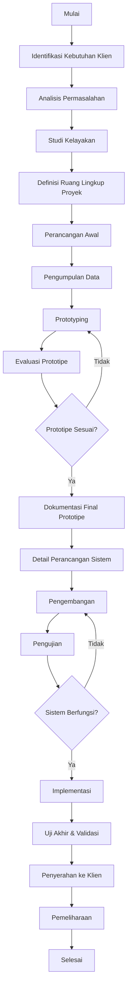

# Workflow Sistem Analisis untuk Merancang Aplikasi atau Website

## Diagram Alur

### Penjelasan Alur
1. **Identifikasi Kebutuhan Klien**: Pahami kebutuhan dan harapan klien melalui diskusi.
2. **Analisis Permasalahan**: Identifikasi permasalahan yang ingin diselesaikan oleh aplikasi/web.
3. **Studi Kelayakan**: Evaluasi apakah proyek ini layak secara teknis, operasional, dan finansial.
4. **Definisi Ruang Lingkup Proyek**: Tetapkan batasan proyek, tujuan, dan hasil akhir.
5. **Perancangan Awal**: Buat wireframe, flowchart, atau desain awal untuk menggambarkan konsep.
6. **Pengumpulan Data**: Kumpulkan data dan sumber daya untuk mendukung perancangan.
7. **Prototyping**: Kembangkan prototipe awal berdasarkan desain.
8. **Evaluasi Prototipe**: Uji prototipe bersama tim dan klien untuk memastikan sesuai kebutuhan.
9. **Detail Perancangan Sistem**: Buat dokumen teknis lengkap (ERD, DFD, spesifikasi teknis).
10. **Pengembangan**: Lakukan coding berdasarkan rancangan.
11. **Pengujian**: Uji fitur untuk memastikan sistem berjalan sesuai spesifikasi.
12. **Implementasi**: Deploy sistem ke lingkungan produksi.
13. **Uji Akhir & Validasi**: Pastikan sistem bekerja optimal dalam skenario pengguna sebenarnya.
14. **Penyerahan ke Klien**: Serahkan sistem dan dokumentasi ke klien.
15. **Pemeliharaan**: Berikan dukungan untuk perbaikan bug dan pengembangan lanjutan.

Jika diagram ini sesuai kebutuhan, Anda dapat memodifikasinya lebih lanjut! 😊

# Workflow Sistem Analisis untuk Merancang Aplikasi atau Website

## Tahapan dan Tools yang Digunakan

### 1. Identifikasi Kebutuhan Klien
- **Deskripsi**: Pahami kebutuhan dan harapan klien melalui diskusi.
- **Tools**:
  - Google Meet / Zoom (Komunikasi)
  - Notion / Evernote (Pencatatan)
  - Miro / Mural (Kolaborasi)

### 2. Analisis Permasalahan
- **Deskripsi**: Identifikasi permasalahan yang ingin diselesaikan oleh aplikasi/web.
- **Tools**:
  - Microsoft Word / Google Docs (Dokumentasi)
  - Lucidchart / Draw.io (Diagram Analisis)
  - Miro (Diskusi Tim)

### 3. Studi Kelayakan
- **Deskripsi**: Evaluasi apakah proyek ini layak secara teknis, operasional, dan finansial.
- **Tools**:
  - Microsoft Excel / Google Sheets (Analisis Biaya dan Kelayakan)
  - SWOT Analysis Tools (Evaluasi Kelayakan)

### 4. Definisi Ruang Lingkup Proyek
- **Deskripsi**: Tetapkan batasan proyek, tujuan, dan hasil akhir.
- **Tools**:
  - Jira / Trello (Manajemen Proyek)
  - Google Docs / Notion (Dokumentasi Ruang Lingkup)

### 5. Perancangan Awal
- **Deskripsi**: Buat wireframe, flowchart, atau desain awal untuk menggambarkan konsep.
- **Tools**:
  - Figma / Adobe XD (Wireframing dan Mockup)
  - Lucidchart / Balsamiq (Flowchart atau Diagram Proses)

### 6. Pengumpulan Data
- **Deskripsi**: Kumpulkan data dan sumber daya untuk mendukung perancangan.
- **Tools**:
  - Google Forms / Typeform (Pengumpulan Feedback)
  - Airtable (Manajemen Data)

### 7. Prototyping
- **Deskripsi**: Kembangkan prototipe awal berdasarkan desain.
- **Tools**:
  - Figma / Sketch (Desain Prototipe)
  - Axure / InVision (Prototyping Interaktif)

### 8. Evaluasi Prototipe
- **Deskripsi**: Uji prototipe bersama tim dan klien untuk memastikan sesuai kebutuhan.
- **Tools**:
  - Maze / Lookback.io (Uji Pengguna)
  - Google Meet / Zoom (Review Prototipe Bersama Tim/Klien)

### 9. Detail Perancangan Sistem
- **Deskripsi**: Buat dokumen teknis lengkap (ERD, DFD, spesifikasi teknis).
- **Tools**:
  - MySQL Workbench / DbVisualizer (Desain Database)
  - Lucidchart / Visual Paradigm (ERD dan DFD)

### 10. Pengembangan
- **Deskripsi**: Lakukan coding berdasarkan rancangan.
- **Tools**:
  - Visual Studio Code / IntelliJ IDEA (Coding)
  - Git / GitHub / GitLab (Version Control)
  - Postman (API Testing)

### 11. Pengujian
- **Deskripsi**: Uji fitur untuk memastikan sistem berjalan sesuai spesifikasi.
- **Tools**:
  - Selenium / Cypress (Automated Testing)
  - Jira (Bug Tracking)
  - Postman / Swagger (API Testing)

### 12. Implementasi
- **Deskripsi**: Deploy sistem ke lingkungan produksi.
- **Tools**:
  - Docker / Kubernetes (Deployment)
  - AWS / Azure / GCP (Hosting dan Deployment)

### 13. Uji Akhir & Validasi
- **Deskripsi**: Pastikan sistem bekerja optimal dalam skenario pengguna sebenarnya.
- **Tools**:
  - BrowserStack / Sauce Labs (Cross-Browser Testing)
  - JMeter / LoadRunner (Stress Testing)

### 14. Penyerahan ke Klien
- **Deskripsi**: Serahkan sistem dan dokumentasi ke klien.
- **Tools**:
  - Notion / Confluence (Dokumentasi Penyerahan)
  - Google Drive / Dropbox (Berbagi File)

### 15. Pemeliharaan
- **Deskripsi**: Berikan dukungan untuk perbaikan bug dan pengembangan lanjutan.
- **Tools**:
  - LogRocket / Sentry (Error Tracking)
  - Jira / Trello (Manajemen Update)
