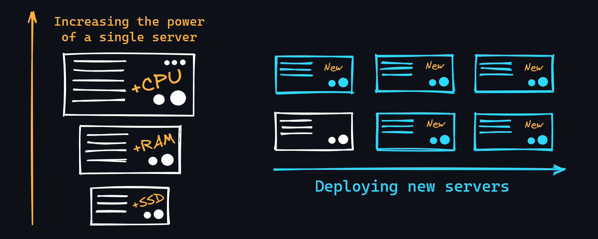

# Horizontal vs Vertical Scaling 📈🛠️

## Kenalan Dulu 🤓
Seiring waktu, ketika beban aplikasi kamu mulai tumbuh (lebih banyak pengguna, fungsionalitas baru muncul, dan akibatnya lebih banyak waktu CPU yang terlibat), perlu untuk meningkatkan kapasitas server. Ada dua pendekatan utama untuk ini:

---

## Vertical Scaling ⬆️
Vertical scaling itu kayak naikin level karakter di game. Kamu nambahin kapasitas server yang udah ada. Contohnya:
- **Tambah RAM**: Biar bisa nangani lebih banyak data sekaligus.
- **Pakai penyimpanan yang lebih cepat**: Biarkan aplikasi berjalan lebih mulus.
- **Upgrade CPU**: Beli prosesor dengan kecepatan clock yang lebih tinggi atau lebih banyak inti dan thread.

### Kelebihan 🌟
- **Sederhana**: Cukup upgrade server yang sudah ada, tanpa perlu repot-repot mengatur yang baru.
- **Peningkatan performa langsung**: Nggak perlu banyak perubahan pada arsitektur aplikasi.

### Kekurangan ⚠️
- **Ada batasnya**: Nggak bisa terus-terusan naikin kapasitas server yang sama.
- **Biaya tinggi**: Upgrade hardware bisa mahal dan bikin budget melonjak.

---

## Horizontal Scaling ➡️
Horizontal scaling itu kayak nambah anggota tim di proyek. Kamu menambahkan server baru dan mendistribusikan logika aplikasi ke banyak mesin fisik.

### Kelebihan 🌟
- **Skalabilitas tinggi**: Nggak ada batasan berapa banyak server yang bisa ditambahkan.
- **Tahan banting**: Kalo satu server down, yang lain masih bisa jalan.

### Kekurangan ⚠️
- **Kompleksitas**: Perlu arsitektur yang kuat untuk mendistribusikan beban di antara server.
- **Manajemen lebih rumit**: Memerlukan lebih banyak waktu dan usaha untuk mengelola banyak server.

---

## Kesimpulan 🎉
Pemilihan antara horizontal dan vertical scaling tergantung pada kebutuhan aplikasi kamu. Vertical scaling cocok untuk beban kerja kecil, sedangkan horizontal scaling lebih baik untuk aplikasi yang tumbuh pesat dengan banyak pengguna. Pilih yang sesuai dengan kebutuhanmu! 💪💻

## Referensi 🔗
- [Vertical vs Horizontal Scaling](https://www.digitalocean.com/community/tutorials/vertical-vs-horizontal-scaling)
- [Understanding Scaling](https://aws.amazon.com/architecture/scaling/)

