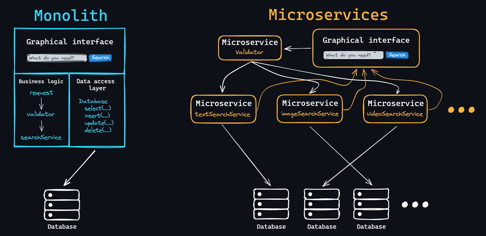
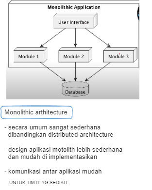
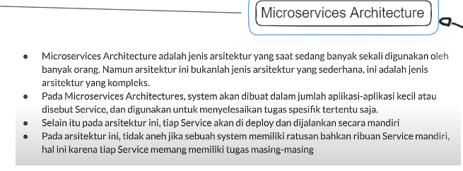
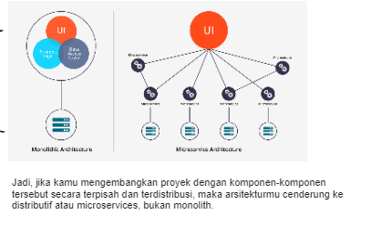

# Monolithic vs Microservice Architecture 🏛️⚙️

## Monolithic Architecture 🏢

Monolith itu kayak aplikasi utuh yang punya satu kode dasar (ditulis dalam satu teknologi stack dan disimpan di satu repositori) dan punya satu titik masuk untuk menjalankan seluruh aplikasi. Ini adalah pendekatan paling umum buat membangun aplikasi sendiri atau bareng tim kecil.

### Keuntungan 👍
- **Mudah dalam pengembangan**: Semua ada dalam satu gaya dan di satu tempat.
- **Mudah dalam deployment**: Cukup satu aplikasi yang dideploy.
- **Mudah diskalakan di awal**: Cocok buat start-up yang butuh kecepatan.

### Kerugian 👎
- **Meningkatnya kompleksitas**: Seiring proyek tumbuh, threshold masuk buat developer baru jadi lebih tinggi.
- **Waktu untuk assemble dan start-up bertambah**: Semakin besar, semakin lama.
- **Menambah fungsionalitas baru jadi lebih sulit**: Fitur baru bisa mempengaruhi fungsi yang udah ada.
- **Susah (atau bahkan nggak mungkin) menerapkan teknologi baru**: Terbatas pada stack yang ada.

---

## Microservice Architecture 🚀
Microservice itu juga aplikasi utuh dengan kode dasar yang sama. Tapi, bedanya, aplikasi ini cuma bertanggung jawab untuk satu unit fungsional. Yaitu, layanan kecil yang cuma nyelesain satu tugas, tapi dengan baik.

### Keuntungan 🌟
- **Setiap microservice bisa punya teknologi stack sendiri**: Masing-masing bisa berkembang secara mandiri.
- **Mudah nambah fungsionalitas baru**: Cukup bikin microservice baru.
- **Threshold masuk lebih rendah untuk developer baru**: Lebih gampang untuk belajar.
- **Waktu build dan start-up lebih cepat**: Agak lebih efisien.

### Kerugian ⚠️
- **Kompleksitas implementasi interaksi antar microservices**: Harus paham cara mereka saling berkomunikasi.
- **Lebih sulit dioperasikan daripada beberapa monolith**: Banyak yang harus dipantau.
- **Kompleksitas dalam melakukan transaksi**: Butuh perhatian lebih.
- **Perubahan yang mempengaruhi beberapa microservices harus dikoordinasikan**: Jangan sampai ada yang terlewat.

---

## Kesimpulan 🎉
Monolithic dan microservice architecture punya kelebihan dan kekurangan masing-masing. Pilihan antara keduanya tergantung pada skala proyek dan tim yang ada. Keduanya punya peran penting dalam dunia pengembangan software sekarang ini! 💻🌍

## Referensi 🔗
- [Monolithic vs Microservices](https://microservices.io)
- [Understanding Microservices Architecture](https://martinfowler.com/articles/microservices.html)

