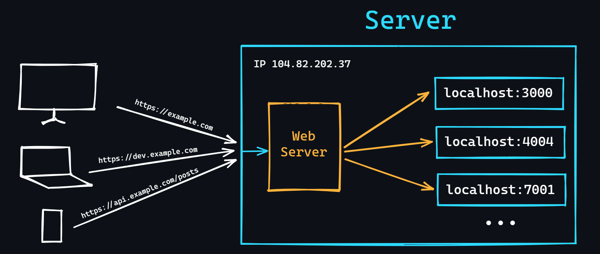

# Web Servers

## Apa itu Web Server?
Web server adalah program yang dirancang untuk menangani permintaan HTTP yang masuk. Selain itu, web server juga dapat menyimpan log kesalahan (logs), melakukan otentikasi dan otorisasi, serta menyimpan aturan untuk pemrosesan file, dan lain-lain.

### Fungsi Web Server
- **Menangani Permintaan HTTP**: Web server menerima permintaan dari klien (biasanya browser) dan mengirimkan kembali respon yang sesuai, seperti halaman HTML, gambar, atau data lainnya.
- **Log Kesalahan**: Web server menyimpan catatan tentang kesalahan yang terjadi, yang dapat digunakan untuk analisis dan pemecahan masalah.
- **Otentikasi dan Otorisasi**: Web server dapat memverifikasi identitas pengguna dan memastikan bahwa mereka memiliki izin untuk mengakses sumber daya tertentu.
- **Pengolahan File**: Web server dapat mengelola file statis (seperti gambar dan CSS) dan dinamis (seperti skrip PHP).

## Kenapa Membutuhkan Web Server?
Tidak semua bahasa pemrograman dapat memiliki server web bawaan (misalnya, PHP). Oleh karena itu, untuk menjalankan aplikasi web yang ditulis dalam bahasa tersebut, diperlukan web server pihak ketiga. Sebuah server (virtual atau dedicated) dapat menjalankan beberapa aplikasi, tetapi hanya dengan satu alamat IP eksternal. Web server yang terkonfigurasi dengan baik dapat menyelesaikan masalah ini dan mengalihkan permintaan yang masuk ke aplikasi yang tepat.

## Web Server Populer
1. **Nginx**
   - Saat ini, Nginx adalah server web yang paling populer.
   - Dikenal karena performa tinggi, stabilitas, dan kemampuannya untuk menangani banyak koneksi secara bersamaan.
   - Sering digunakan sebagai reverse proxy dan load balancer.

2. **Apache**
   - Server web yang juga sangat populer, tetapi perlahan-lahan kehilangan pangsa pasarnya.
   - Dikenal karena fleksibilitas dan banyaknya modul yang tersedia.
   - Memiliki konfigurasi berbasis file `.htaccess` yang memungkinkan pengaturan yang lebih granular.

3. **Caddy**
   - Server web yang relatif baru dengan potensi besar.
   - Dikenal karena kemudahan penggunaan dan pengaturan otomatis untuk HTTPS.
   - Memiliki konfigurasi berbasis file `Caddyfile` yang sederhana dan intuitif.

## Kesimpulan
Web server memainkan peran penting dalam pengembangan dan penyebaran aplikasi web. Memilih server yang tepat bergantung pada kebutuhan spesifik aplikasi, preferensi pengembang, dan lingkungan di mana aplikasi tersebut akan dijalankan.

### Referensi
- [Nginx](https://www.nginx.com/)
- [Apache](https://httpd.apache.org/)
- [Caddy](https://caddyserver.com/)
