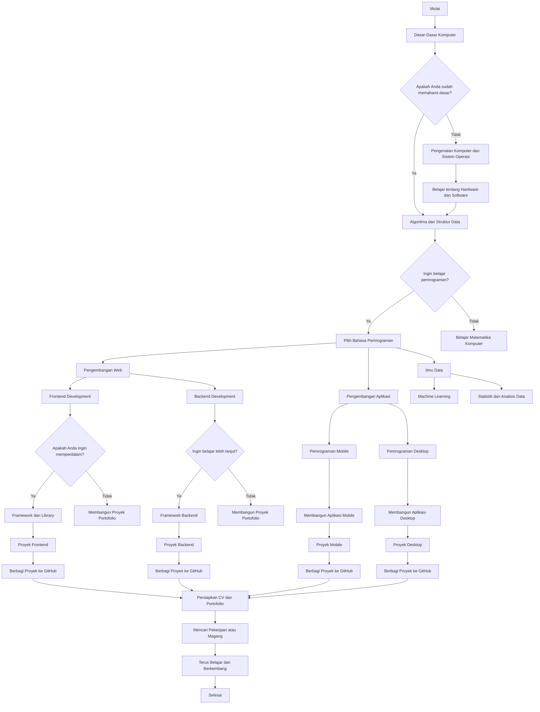

# Alur Pembelajaran Computer Science

```mermaid
graph TD
    A[Mulai] --> B[Dasar-Dasar Komputer]
    B --> C{Apakah Anda sudah memahami dasar?}
    C -->|Ya| D[Algoritma dan Struktur Data]
    C -->|Tidak| E[Pengenalan Komputer dan Sistem Operasi]
    E --> F[Belajar tentang Hardware dan Software]
    F --> D

    D --> G{Ingin belajar pemrograman?}
    G -->|Ya| H[Pilih Bahasa Pemrograman]
    G -->|Tidak| I[Belajar Matematika Komputer]
    
    H --> J[Pengembangan Web]
    H --> K[Pengembangan Aplikasi]
    H --> L[Ilmu Data]
    
    J --> M[Frontend Development]
    J --> N[Backend Development]
    
    K --> O[Pemrograman Mobile]
    K --> P[Pemrograman Desktop]
    
    L --> Q[Machine Learning]
    L --> R[Statistik dan Analisis Data]
    
    M --> S{Apakah Anda ingin memperdalam?}
    S -->|Ya| T[Framework dan Library]
    S -->|Tidak| U[Membangun Proyek Portofolio]
    
    N --> V{Ingin belajar lebih lanjut?}
    V -->|Ya| W[Framework Backend]
    V -->|Tidak| X[Membangun Proyek Portofolio]
    
    O --> Y[Membangun Aplikasi Mobile]
    P --> Z[Membangun Aplikasi Desktop]
    
    T --> AA[Proyek Frontend]
    W --> AB[Proyek Backend]
    Y --> AC[Proyek Mobile]
    Z --> AD[Proyek Desktop]
    
    AA --> AE[Berbagi Proyek ke GitHub]
    AB --> AF[Berbagi Proyek ke GitHub]
    AC --> AG[Berbagi Proyek ke GitHub]
    AD --> AH[Berbagi Proyek ke GitHub]
    
    AE --> AI[Persiapkan CV dan Portofolio]
    AF --> AI
    AG --> AI
    AH --> AI
    
    AI --> AJ[Mencari Pekerjaan atau Magang]
    AJ --> AK[Terus Belajar dan Berkembang]
    AK --> AL[Selesai]
```