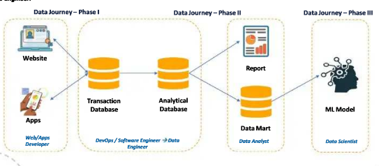
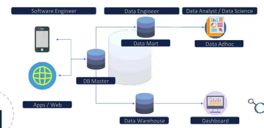
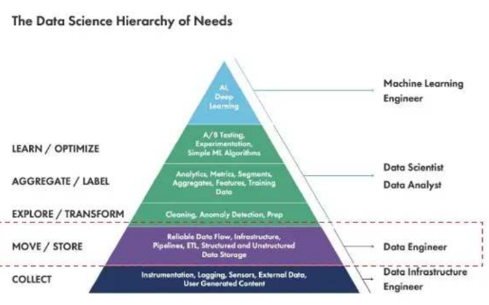
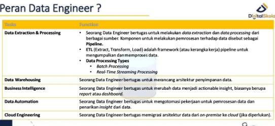

# 🚀 **DATA ENGINEER** -> Memahami Data Journey - Big Picture

()

## **Data Mart 🏬**
Data mart adalah **subkumpulan** dari data dalam data warehouse yang difokuskan pada **kebutuhan bisnis** tertentu atau **departemen tertentu** dalam organisasi. 📊

### **Contoh Penggunaan Data Mart:**

- **Data Mart Pemasaran**: Berisi data yang **relevan untuk analisis kampanye pemasaran**, profil pelanggan, dan segmentasi pasar. 📈
- **Data Mart Penjualan**: Berisi data yang **mendukung analisis kinerja penjualan**, pelacakan penjualan per produk, dan analisis tren penjualan. 💰
- **Data Mart Keuangan**: Berisi data yang **digunakan untuk analisis anggaran**, laporan keuangan, dan pemantauan kinerja keuangan. 📉

## **Peran Data Engineer 🔧**
Data Engineer merupakan bagian dari **Ecosystem Flow data**, kerjanya mirip **software engineer** tapi **berfokus pada arsitektur data**. 🏗️

### Singkatnya:
Data Engineer adalah **software engineer** dengan **spesialisasi** dalam menyiapkan **arsitektur data** untuk analisis dan operasional. 💻

Menurut **Data Science Hierarchy**: 
Data Engineer bertanggung jawab memastikan data dapat digunakan dan **reliable**. ✅

### **Tugas Data Engineer** 🔍
Tugas utama Data Engineer adalah **Data Extraction** dan **data Processing** dari berbagai sumber. 📥

Pipeline dalam konteks data adalah **rangkaian proses** atau tahapan yang mengalirkan dan mengolah data dari sumber awal hingga hasil akhir. Setiap tahap dalam pipeline melakukan tugas tertentu, seperti **pengumpulan data**, **pembersihan**, **transformasi**, **analisis**, dan **penyimpanan**. 📦

## **Problem BIG DATA 🤯**
Salah satu masalah dalam BIG DATA adalah **memoir** dan waktu yang dibutuhkan untuk memproses data, sehingga tidak semua data dapat diproses. ⏳

## **BIG DATA TOOLS 🛠️**

- **Database**: PostgreSQL
- **Storage**: Amazon S3

