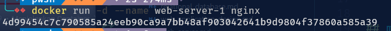

## mejalankan container (1/3)

```golang
docker run [OPTIONS] IMAGE [COMMAND] [ARG...]
```

## menjalankan docker container (2/3)

```golang
~ docker run nginx
```

## check status log

```golang
docker ps -a
```

## menjalankan container (3/3)

```golang
docker run -d --name web-server-1 nginx
```
- # Opsi -d (detach) memungkinkan container berjalan di belakang layar

- # Opsi --name --> digunakan untuk memberikan nama container yg akan dijalankan

* kalo ga buat nama, bakal digenerate random



# angka random diatas adalah id docker nya, yg sedang berjalan
