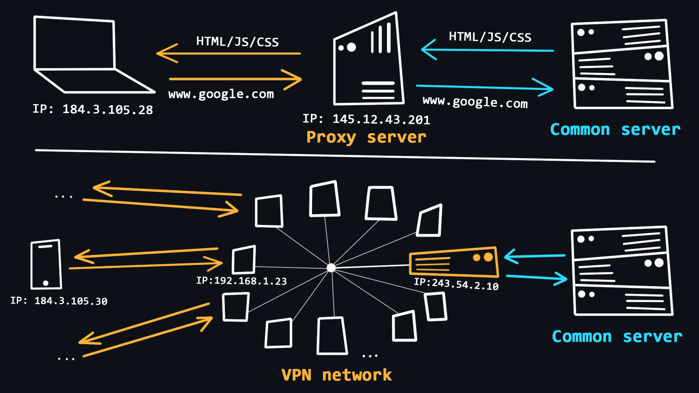

# Browser: Cara Kerja dan Fitur-Fiturnya

### Browser: Apa Itu?
Browser itu ibarat jendela buat liat konten di internet. Intinya, dia dipakai buat ngirim request ke server buat ambil file-file (biasanya HTML) yang nanti bakal dirender jadi tampilan web. Selain itu, browser juga bisa nyari dan download file-file dari internet. Jadi, kamu bisa nge-browsing apa aja!

---

## Cara Kerja
Browser nggak cuma buat tampilin halaman web, tapi juga ada beberapa mekanisme keren di belakangnya:
- **Query Handling**: Browser ngirim request (pertanyaan) ke server buat minta file yang diperlukannya.
- **Page Rendering**: Browser nerjemahin file HTML, CSS, dan JavaScript jadi halaman web yang kamu lihat.
- **Tab Feature**: Tiap tab di browser punya proses sendiri, supaya kalo ada satu tab yang crash, nggak bakal ngefek ke tab lain. Jadi aman deh!

---

## Extensions
Browser juga punya fitur ekstensi, yang bikin kamu bisa:
- **Ubah UI**: Bikin tampilan browser jadi lebih sesuai selera.
- **Modifikasi Webpage**: Bisa ngeganti atau nambahin konten di halaman web sesuai kebutuhanmu.
- **Ubah Network Request**: Bisa ngatur ulang request dari dan ke server.

---

## Chrome DevTools
Ini tools yang nggak bisa dipisahin dari web developer. Bikin kamu bisa analisa macem-macem info soal halaman web:
- **Monitoring Performance**: Cek performa halaman biar makin optimal.
- **Tracking Logs**: Liat aktivitas atau error yang terjadi di halaman.
- **Network Requests**: Bisa banget nih, ngelacak info penting soal request yang dikirim atau diterima sama halaman web yang lagi dibuka.

---

## Visualisasi Browser Components

```mermaid
graph TB
    A[Browser] --> B[Query Handling]
    A --> C[Page Rendering]
    A --> D[Tab Feature]
    A --> E[Extensions]
    A --> F[Chrome DevTools]
    
    E --> G[Modify UI]
    E --> H[Modify Webpage]
    E --> I[Modify Network Request]
    
    F --> J[Monitor Performance]
    F --> K[Track Logs]
    F --> L[Track Network Requests]
