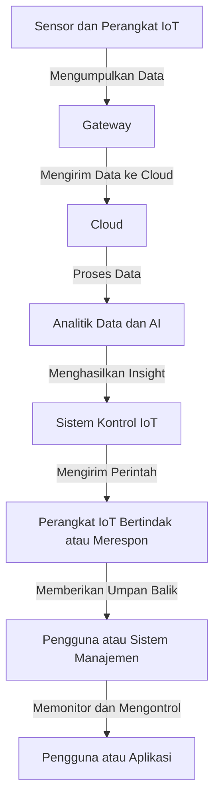

# Internet of Things (IoT)

## Apa Itu IoT?
Internet of Things (IoT) adalah konsep yang merujuk pada jaringan perangkat fisik, kendaraan, mesin, dan objek lainnya yang dilengkapi dengan sensor, perangkat lunak, dan konektivitas internet. IoT memungkinkan objek-objek tersebut untuk mengumpulkan, bertukar data, dan berinteraksi satu sama lain, meningkatkan otomatisasi, efisiensi, dan kemampuan pemantauan dalam berbagai bidang.

## Komponen Lengkap IoT
1. **Perangkat dan Sensor IoT**:
   - Komponen fisik yang mengumpulkan data dari lingkungan. Contohnya meliputi:
     - **Sensor Suhu**: Mengukur suhu lingkungan.
     - **Sensor Kelembapan**: Mengukur tingkat kelembapan di udara atau tanah.
     - **Kamera Keamanan**: Memantau area tertentu dan mengirimkan gambar atau video.

2. **Gateway**:
   - Perangkat yang berfungsi sebagai jembatan antara sensor dan cloud. Contohnya:
     - **Router IoT**: Menghubungkan perangkat IoT ke internet dan mengelola lalu lintas data.

3. **Cloud**:
   - Infrastruktur yang menyimpan, memproses, dan menganalisis data dari perangkat IoT. Contohnya:
     - **Platform Cloud IoT**: Seperti AWS IoT, Microsoft Azure IoT, atau Google Cloud IoT.

4. **Analitik Data dan AI**:
   - Alat dan algoritma yang digunakan untuk menganalisis data yang terkumpul, menghasilkan wawasan, dan mengidentifikasi pola atau tren. Contohnya:
     - **Algoritma Pembelajaran Mesin**: Untuk memprediksi tren atau mengoptimalkan proses.

5. **Sistem Kontrol IoT**:
   - Sistem yang menggunakan hasil analisis untuk mengirimkan perintah kembali ke perangkat IoT. Contohnya:
     - **Sistem Otomasi Rumah**: Mengontrol lampu, pemanas, dan perangkat lainnya berdasarkan data yang diterima.

6. **Perangkat IoT Bertindak atau Merespon**:
   - Perangkat yang dapat mengambil tindakan berdasarkan perintah dari sistem kontrol. Contohnya:
     - **Smart Thermostat**: Mengatur suhu secara otomatis berdasarkan kebiasaan pengguna.

7. **Aplikasi untuk Monitoring dan Pengendalian**:
   - Antarmuka pengguna yang memungkinkan pemantauan dan pengontrolan perangkat IoT. Contohnya:
     - **Aplikasi Mobile**: Untuk mengontrol perangkat smart home dari jarak jauh.

## Aplikasi IoT di Masyarakat
1. **Smart Home**:
   - Pengontrolan perangkat rumah seperti lampu, termostat, dan kunci pintu untuk meningkatkan kenyamanan dan efisiensi energi.
   - Contoh: Philips Hue (lampu pintar), Nest Thermostat.

2. **Kesehatan**:
   - Perangkat pemantauan kesehatan seperti wearable devices yang mengukur detak jantung, tekanan darah, dan aktivitas fisik.
   - Contoh: Fitbit, Apple Watch.

3. **Pertanian Pintar**:
   - Penggunaan sensor untuk memantau kelembapan tanah, suhu, dan kondisi tanaman, membantu petani mengelola sumber daya dengan lebih efisien.
   - Contoh: Sistem irigasi otomatis berdasarkan data kelembapan tanah.

4. **Kota Cerdas**:
   - Pengelolaan infrastruktur kota, termasuk pengaturan lalu lintas, pemantauan kualitas udara, dan pengelolaan limbah dengan teknologi IoT.
   - Contoh: Smart traffic lights yang mengatur lampu lalu lintas berdasarkan kepadatan kendaraan.

5. **Industri 4.0**:
   - Otomatisasi dan pemantauan proses industri dengan sensor dan perangkat IoT untuk meningkatkan efisiensi produksi dan mengurangi downtime.
   - Contoh: Sensor yang memantau mesin untuk mendeteksi potensi kerusakan sebelum terjadi.

## Jenis-Jenis IoT
1. **IoT Konsumen**:
   - Perangkat yang digunakan dalam kehidupan sehari-hari, seperti smart speakers, kamera keamanan, dan alat rumah tangga pintar.
   - Contoh: Amazon Echo, Ring Doorbell.

2. **IoT Industri**:
   - Sistem yang digunakan dalam sektor industri untuk mengawasi dan mengontrol proses, seperti mesin otomatis dan pengawasan rantai pasokan.
   - Contoh: IoT dalam manufaktur untuk pelacakan inventaris.

3. **IoT Kesehatan**:
   - Perangkat yang digunakan untuk pemantauan kesehatan dan kondisi medis, seperti alat pengukur glukosa dan perangkat pemantauan jantung.
   - Contoh: Alat pemantau tekanan darah digital.

4. **IoT Pertanian**:
   - Sensor dan sistem yang digunakan untuk mengelola pertanian dan meningkatkan hasil tanaman melalui pemantauan lingkungan.
   - Contoh: Sensor tanah yang memberikan data kelembapan untuk irigasi.

## Pint Tambahan
- **Keamanan IoT**: Dengan semakin banyaknya perangkat yang terhubung, keamanan menjadi perhatian utama. Mengimplementasikan enkripsi, autentikasi yang kuat, dan pembaruan perangkat lunak secara teratur sangat penting untuk melindungi data dan perangkat.
- **Interoperabilitas**: Penting untuk memastikan bahwa perangkat dari berbagai produsen dapat bekerja sama dalam satu ekosistem IoT.
- **Regulasi dan Standar**: Mengikuti regulasi dan standar yang berlaku dalam penggunaan IoT untuk melindungi privasi dan data pengguna.

## Kesimpulan
IoT adalah teknologi yang mengubah cara kita berinteraksi dengan perangkat di sekitar kita, memungkinkan otomatisasi dan pengambilan keputusan berbasis data. Dengan pemahaman tentang komponen, aplikasi, dan jenis-jenisnya, kita dapat memanfaatkan IoT untuk meningkatkan efisiensi dan kualitas hidup di berbagai bidang.
