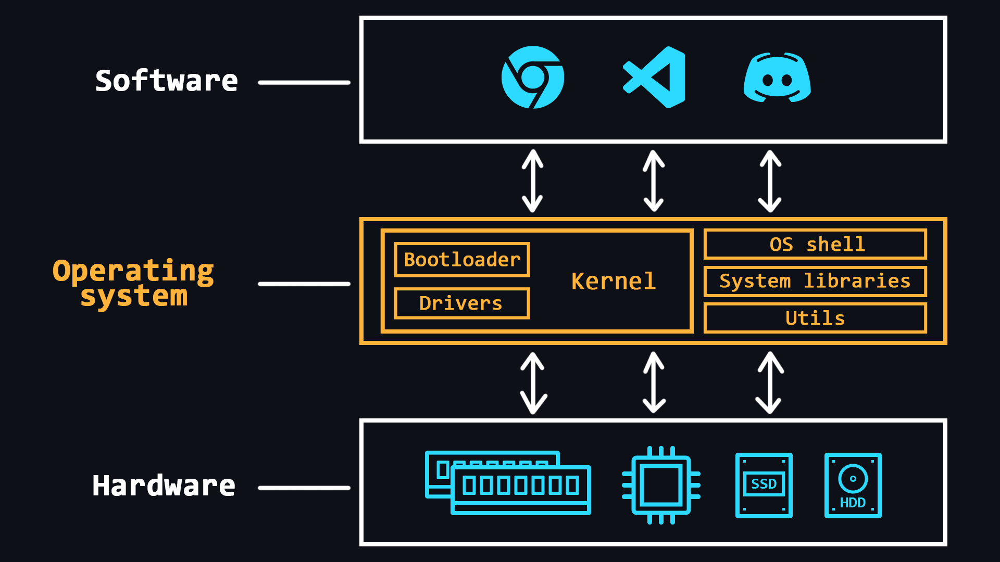

# 🖥️ Desain Sistem Operasi (OS)

Sistem Operasi (OS) adalah perangkat lunak komprehensif yang dirancang untuk mengelola sumber daya komputer. Dengan adanya sistem operasi, pengguna tidak perlu berurusan langsung dengan prosesor, RAM, atau komponen lain dari PC.

OS dapat dianggap sebagai lapisan abstraksi yang mengelola perangkat keras komputer, sehingga menyediakan lingkungan yang sederhana dan nyaman untuk menjalankan perangkat lunak pengguna.

## Fitur Utama

- **Manajemen RAM**: Mengalokasikan ruang untuk program individual.
- **Memuat Program ke dalam RAM**: Mengatur dan mengeksekusi program.
- **Menangani Permintaan dari Program Pengguna**: Menginput dan mengoutput data, memulai dan menghentikan program lain, serta membebaskan atau mengalokasikan memori tambahan.
- **Interaksi dengan Perangkat Input dan Output**: Berfungsi dengan mouse, keyboard, monitor, dan perangkat lainnya.
- **Interaksi dengan Media Penyimpanan**: Mengelola HDD dan SSD.
- **Menyediakan Antarmuka Pengguna**: Baik dalam bentuk konsol shell maupun antarmuka grafis.
- **Pencatatan Kesalahan Perangkat Lunak**: Menyimpan log kesalahan untuk analisis lebih lanjut.

### Fungsi Tambahan (Tergantung pada OS)
- **Mengorganisir Multitasking**: Menjalankan beberapa program secara bersamaan.
- **Delimitasi Akses**: Mengatur akses sumber daya untuk setiap proses.
- **Komunikasi Antar Proses**: Memungkinkan pertukaran data dan sinkronisasi antara proses.
- **Mengorganisir Perlindungan OS**: Melindungi sistem operasi dari program lain dan tindakan pengguna.
- **Mode Multi-Pengguna**: Menyediakan mode multi-pengguna dan membedakan hak akses antara pengguna OS yang berbeda (admin, tamu, dll.).

## Kernel OS
Kernel adalah bagian sentral dari sistem operasi yang digunakan secara intensif. Kernel selalu berada dalam memori, sementara bagian lain dari OS dimuat dan dibongkar dari memori sesuai kebutuhan.

## Bootloader
Bootloader adalah perangkat lunak sistem yang mempersiapkan lingkungan agar OS dapat berjalan. Ini mencakup menempatkan perangkat keras dalam keadaan yang tepat, menyiapkan memori, memuat kernel OS, dan mentransfer kontrol ke kernel tersebut.

## Driver Perangkat
Driver perangkat adalah perangkat lunak khusus yang memungkinkan OS bekerja dengan perangkat tertentu.

---

Dengan pemahaman yang baik tentang desain sistem operasi, Anda dapat menghargai bagaimana OS mengelola sumber daya dan menyediakan lingkungan yang stabil untuk aplikasi dan pengguna.

[PRIMARY COMPONENT OF COMPUTER](komponenutamakomputer.md)