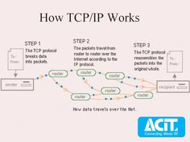

# TCP/IP Stack

### TCP/IP vs OSI
Kalau ngomongin TCP/IP stack, ini tuh lebih simple dibanding OSI model yang lebih ribet dan detail. Secara umum, TCP/IP lebih banyak dipakai dan lebih praktis, sedangkan OSI lebih teori banget dan lebih detail. Dua model ini jelasin prinsip yang sama, cuma beda pendekatan dan protokol yang dipakai di tiap level.

---

## Link Layer
Ini layer yang ngatur gimana data bisa dikirim lewat medium fisik, kayak kabel, sinyal Wi-Fi, Bluetooth, atau fiber optic. Di sini fokusnya pada pengiriman data secara langsung di antara perangkat-perangkat yang terhubung secara fisik.

**Protokol:**
- Ethernet
- Wi-Fi
- Bluetooth
- Fiber Optic

---

## Internet Layer
Layer ini yang ngatur gimana data bisa dipindahin antar jaringan yang berbeda. Jadi dia pakai IP address buat ngenalin devices, terus data dikirim berdasarkan alamat tersebut sampai ke tujuan.

**Protokol:**
- IP (Internet Protocol)
- ARP (Address Resolution Protocol)
- ICMP (Internet Control Message Protocol)
- IGMP (Internet Group Management Protocol)

---

## Transport Layer
Di layer ini, data dikirim antara dua device. Layer ini yang nentuin gimana data bisa sampai dengan benar atau secepat mungkin. Ada dua protokol utama di sini:
- **TCP**: Lebih reliable, tapi lambat. Data dipecah jadi beberapa paket dan dikirim dengan urutan yang benar.
- **UDP**: Cepet, tapi nggak selalu reliable. Data dikirim tanpa ada jaminan sampai dengan urutan yang benar.

---

## Application Layer
Layer ini paling deket sama kamu sebagai user, karena semua layanan yang kamu pake kayak browsing web, email, atau transfer file ada di sini. Layer ini berhubungan langsung sama layer-layer di bawahnya buat memastikan data bisa dikirim dan diterima.

**Protokol:**
- HTTP (HyperText Transfer Protocol)
- FTP (File Transfer Protocol)
- SMTP (Simple Mail Transfer Protocol)
- DNS (Domain Name System)
- SNMP (Simple Network Management Protocol)

---

## Visualisasi TCP/IP Stack

```mermaid
graph TB
    A[TCP/IP Stack] --> B[Link Layer]
    A --> C[Internet Layer]
    A --> D[Transport Layer]
    A --> E[Application Layer]
    
    B --> F[Ethernet]
    B --> G[Wi-Fi]
    B --> H[Bluetooth]
    B --> I[Fiber Optic]
    
    C --> J[IP]
    C --> K[ARP]
    C --> L[ICMP]
    C --> M[IGMP]
    
    D --> N[TCP]
    D --> O[UDP]
    
    E --> P[HTTP]
    E --> Q[FTP]
    E --> R[SMTP]
    E --> S[DNS]
    E --> T[SNMP]
