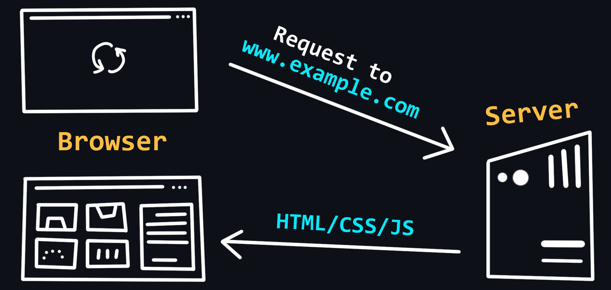

# 🌐 Browser dan Cara Kerjanya

## 📖 Apa Itu Browser?
**Browser** adalah aplikasi andalan kamu untuk menjelajahi dunia maya. Ia mengirim permintaan ke server untuk mengambil file sehingga kamu bisa melihat semua halaman web keren. Anggap saja browser sebagai teman setia untuk membuka file HTML dan mencari apa pun yang kamu inginkan secara online.

---

## ⚙️ Bagaimana Cara Kerjanya?
Browser itu seperti multitasker yang menangani segala hal mulai dari pemrosesan kueri hingga merender halaman. Selain itu, setiap tab berjalan di dunianya sendiri (alias proses), jadi kekacauan di satu tab tidak akan mengganggu yang lain.

 <!-- Ganti dengan URL gambar yang relevan -->

---

## 🎨 Ekstensi: Sesuaikan Gaya Kamu
Mau bikin pengalaman browsing kamu jadi lebih unik? **Ekstensi** adalah solusinya! Mereka memungkinkan kamu untuk:
- Mengubah antarmuka browser
- Mengubah konten halaman web
- Memodifikasi permintaan jaringan

Ini seperti memiliki kekuatan super untuk browser kamu!

---

## 🛠️ Chrome DevTools: Sahabat Developer Kamu
Kalau kamu tertarik dengan pengembangan web, **Chrome DevTools** adalah alat yang wajib ada di toolkit kamu. Fitur canggih ini memungkinkan kamu untuk:
- Menyelami semua detail kecil halaman web
- Memantau kinerja
- Mengecek log
- Melacak permintaan jaringan seperti seorang pro

---

# 🌐 **Browser dan Cara Kerjanya**

## Apa Itu Browser?
Browser adalah aplikasi andalan kamu untuk menjelajahi dunia maya. Dia ngirim permintaan ke server untuk ambil file, jadi kamu bisa cek semua halaman web keren. Anggap aja browser itu sahabat setia buat buka file HTML dan nyari apa pun yang kamu mau secara online. Browser yang umum digunakan termasuk **Google Chrome**, **Mozilla Firefox**, dan **Microsoft Edge**.

---

## 🚀 **Gimana Cara Kerjanya?**
Browser itu kayak multitasker yang nanganin segala hal dari pemrosesan kueri sampai merender halaman. Proses yang terjadi di dalam browser antara lain:
1. **Mengirim Permintaan**: Browser mengirim permintaan HTTP ke server untuk mendapatkan data.
2. **Menerima Respon**: Server mengirimkan kembali file, seperti HTML, CSS, dan JavaScript.
3. **Merender Halaman**: Browser memproses file-file tersebut dan menampilkan halaman web di layar kamu.

Setiap tab berjalan di dunianya sendiri (alias proses), jadi kekacauan di satu tab nggak bakal ganggu tab yang lain. Ini membuat browsing jadi lebih stabil!

---

## 🎨 **Ekstensi: Sesuaikan Gaya Kamu**
Mau bikin pengalaman browsing kamu jadi lebih unik? Ekstensi adalah solusinya! Mereka memungkinkan kamu untuk:
- **Mengubah antarmuka browser**: Modifikasi tampilan browser agar sesuai dengan selera kamu.
- **Memodifikasi konten halaman web**: Tambahkan fitur baru atau ubah cara tampilan halaman web.
- **Mengubah permintaan jaringan**: Intersep dan modifikasi data yang dikirim dan diterima.

Ini kayak punya kekuatan super buat browser kamu! Beberapa ekstensi populer termasuk **AdBlock**, **Grammarly**, dan **Honey**.

---

## 🛠️ **Chrome DevTools: BFF Developer Kamu**
Kalau kamu tertarik dengan pengembangan web, **Chrome DevTools** adalah alat yang wajib ada di toolkit kamu. Fitur ini memungkinkan kamu untuk:
- **Menganalisa detail-detail kecil halaman web**: Cek struktur HTML, CSS, dan JavaScript.
- **Memantau performa**: Lihat waktu loading dan penggunaan sumber daya.
- **Mengecek log**: Lihat error dan peringatan dari kode kamu.
- **Melacak permintaan jaringan**: Monitor semua permintaan yang dilakukan oleh halaman web.

Dengan DevTools, kamu bisa mengoptimalkan dan memperbaiki situs web kamu dengan lebih mudah!

---

Dengan README ini, kamu bisa lebih memahami tentang browser dan cara kerjanya dengan cara yang asyik dan menarik! 🎉

[HOW BROWSER WORKS?](how_browser_work.md)